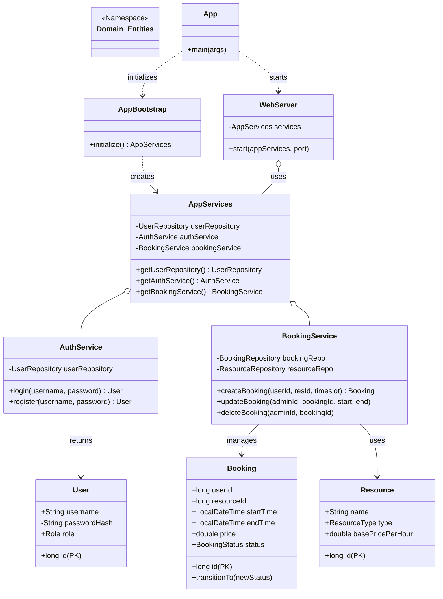

# Smart Booking Platform (Study Rooms)

University-scale booking system for study rooms with dynamic pricing, approvals, payments, cancellations/refunds, and full auditability. The platform models a complete booking lifecycle (requested → approved → paid → active → completed/cancelled/refunded) and enforces policy-driven business rules per resource type. It ships with a JavaFX GUI (default) and an optional CLI mode.

## Features
### Core System
- Register/login (local auth)
- Browse study rooms + availability (conflict checks)
- Create booking requests with dynamic pricing
- Admin approval/rejection for selected rooms
- Payment simulation + refund logic
- Booking lifecycle state machine
- Audit log of actions

### Modern UI/UX
- **Java Desktop Overhaul**: Modern Indigo theme, card-based layouts, and a custom **Interactive Timetable** with drag-selection.
- **Web Client**: React-based dashboard with real-time-like updates and a synchronized timetable view.

## Tech Stack
- Java 17
- SQLite (JDBC)
- Maven (fat JAR via Shade)
- JUnit 5
## Project Structure
```
src/                              # Java Source
web-client/                       # React Web Client (Vite)
pom.xml                           # Maven Configuration
smart_booking.db                  # SQLite Database
```

## Build
```
mvn clean package
```

Database file `smart_booking.db` will be created in the project root on first run.

## Web Client Setup
The web client is located in the `web-client` directory.
```bash
cd web-client
npm install
npm run dev
```
The backend server starts automatically on port 8080 when you run the main application (`com.smartbooking.App`). Both the JavaFX GUI and the CLI modes will start the web server in the background.

## Default Accounts
- Admin: `admin` / `admin123`
- Customer: `alice` / `password`
- Customer: `bob` / `password`

## Policies (Strategy)
Resources are configured with policy keys in `resources` table.
- Pricing: `DEFAULT`, `PEAK_HOURS`, `WEEKEND`, `PEAK_WEEKEND`
- Cancellation: `FLEXIBLE`, `STRICT`
- Approval: `AUTO`, `ADMIN_REQUIRED`

`PolicyFactory` resolves keys to policy implementations without changing booking logic.

## Booking Lifecycle (State)
`REQUESTED -> APPROVED -> PAID -> ACTIVE -> COMPLETED`
- `REQUESTED` can be `REJECTED` or `CANCELLED`
- `CANCELLED -> REFUNDED` (if policy allows)

Illegal transitions throw an exception.

## Tests
```
mvn test
```
Includes policy tests, state transition tests, and conflict detection tests.

## Design Patterns
- Strategy: pricing/approval/cancellation policies
- State: booking lifecycle transitions
- Factory: policy creation and booking creation
- Observer: booking notifications
- DAO/Repository: persistence layer

## System Architecture (UML)



## Notes for Assignment
- Layered architecture with domain, service, persistence, and UI
- SOLID principles demonstrated by modular services and pluggable policies
- Seed data provides 10 study rooms + sample users
